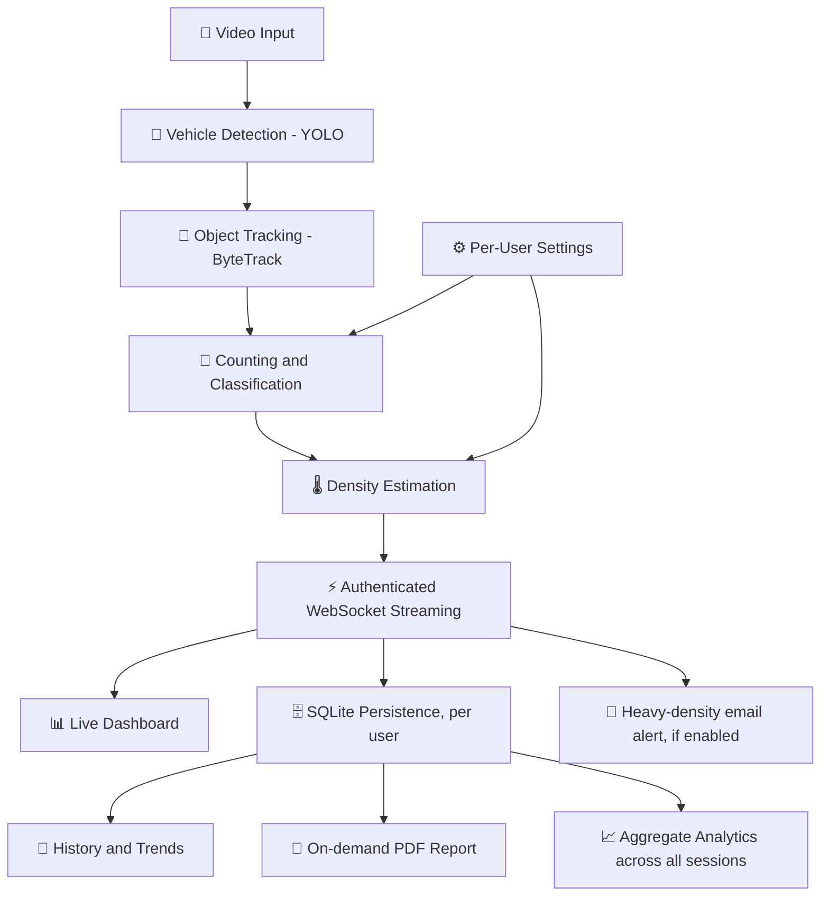
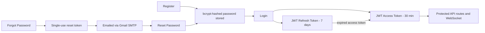

# 🚦 AI Traffic Analyzer


**AI-powered traffic video analysis: detect, track, count, and classify vehicles, estimate real-time traffic density, and visualize it all on a live analytics dashboard — secured behind real, backend-enforced user authentication, with per-account configuration, profiles, downloadable PDF reports, and cross-session aggregate analytics.**

Built as a college mini project combining **Computer Vision**, **AI**, **Web Development**, and **Data Visualization**.

---

## 📖 Table of Contents

- [Overview](#-overview)
- [Features](#-features)
- [Tech Stack](#️-tech-stack)
- [System Pipeline](#-system-pipeline)
- [Authentication](#-authentication)
- [Project Structure](#-project-structure)
- [Getting Started](#-getting-started)
- [Application Pages](#️-application-pages)
- [Project Task Tracker](#-project-task-tracker)
- [Dataset Notes](#-dataset-notes)
- [Known Limitations](#️-known-limitations)
- [License](#-license)

---

## 🧭 Overview

Traditional traffic monitoring relies on manual counting or expensive dedicated hardware (inductive loops, radar), neither of which scales or gives vehicle-type-level insight. **AI Traffic Analyzer** turns any uploaded video into structured traffic data using a pretrained YOLO model, tracks vehicles across frames to avoid double-counting, classifies them by type, estimates congestion, and streams the results to a web dashboard in real time — behind a real login system, with every session, setting, profile, report, and aggregate statistic tied to the account that owns it.

## ✨ Features

- 🚗 **Vehicle Detection** — pretrained YOLO model detects car, bus, truck, motorcycle, and bicycle per frame
- 🎯 **Multi-Object Tracking** — ByteTrack assigns each vehicle a persistent ID across frames
- 📏 **Line-Crossing Counting** — accurate one-time counts per vehicle, broken down by class
- 🌡️ **Density Estimation** — live congestion level (Light / Moderate / Heavy), smoothed over a rolling window
- ⚡ **Real-Time Streaming** — live analytics pushed to the browser over an authenticated WebSocket as the video is processed
- 🗄️ **Persistent History** — every session is saved to a database, scoped to its owner, searchable and filterable, with full trend data and both CSV and PDF export per session
- 📊 **Live Dashboard** — video preview, live stat cards, and charts, all fed from the real pipeline
- 🔐 **Real Authentication** — registration, login, JWT access + refresh tokens, and email-based password reset, all enforced server-side
- ⚙️ **Per-User Settings** — density thresholds, counting line position, smoothing window, and detection sensitivity are all editable and actually drive the pipeline on your next run
- 📧 **Live Density Alerts** — optionally get emailed the moment a session reaches Heavy congestion
- 👤 **Real Profiles** — editable name/email, secure password change, real lifetime stats computed from your session history, and photo upload
- 📄 **PDF Reports** — server-generated, professionally formatted PDF for any completed session, with a real embedded trend chart and per-class breakdown table
- 📈 **Aggregate Analytics** — cross-session insights computed server-side: total vehicles ever counted, density distribution, all-time vehicle-type breakdown, busiest session, and day-by-day activity trend

## 🛠️ Tech Stack

| Layer | Technology |
|---|---|
| 🧠 Computer Vision | Ultralytics YOLO (YOLOv8 / YOLO26) + OpenCV |
| 🎯 Tracking | ByteTrack (via Ultralytics `model.track()`) |
| ⚙️ Backend | Python, FastAPI, WebSockets |
| 🔐 Auth | JWT (access + refresh tokens), bcrypt password hashing, Gmail SMTP for reset/alert emails |
| 📄 Reporting | ReportLab (PDF layout) + Matplotlib (chart rendering) |
| 📈 Analytics | SQLAlchemy aggregate queries (GROUP BY / SUM across sessions) |
| 🎨 Frontend | React + TypeScript, Vite, Tailwind CSS v4 |
| 🗄️ Database | SQLite via SQLAlchemy |
| 🖼️ File Storage | FastAPI static file serving (avatars), local disk (videos) |
| 🚀 Deployment (planned) | Docker |

## 🔄 System Pipeline



## 🔐 Authentication

Every session is tied to a real, backend-verified account — not just a UI login screen.



- Passwords are hashed with **bcrypt**, never stored or logged in plain text.
- Access tokens expire in 30 minutes; the frontend automatically refreshes them using the longer-lived refresh token, so an active user is never unexpectedly logged out mid-session.
- Password reset links are single-use, expire after 30 minutes, and are sent via real email (Gmail SMTP), not just simulated.
- All video upload, analytics streaming, session-history, report, and analytics endpoints require a valid token — every user only ever sees their **own** analysis history, settings, profile, reports, and aggregate stats.

## 📁 Project Structure

```
AI_Traffic_Analyzer/
├── backend/
│   ├── .env                        # SECRET_KEY, SMTP credentials (never committed)
│   └── app/
│       ├── main.py                 # FastAPI app, routes, authenticated WebSocket, PDF endpoint
│       ├── api/
│       │   ├── auth_router.py      # register / login / refresh / forgot / reset / profile / avatar
│       │   ├── settings_router.py  # GET/PUT per-user pipeline settings
│       │   └── analytics_router.py # GET aggregate stats across all of a user's sessions
│       ├── schemas/
│       │   ├── auth_schemas.py     # Auth + profile request/response models
│       │   ├── settings_schemas.py # Settings request/response models
│       │   └── analytics_schemas.py# Analytics summary response models
│       └── core/
│           ├── pipeline.py         # Detection + tracking + counting + density (settings-driven)
│           ├── database.py         # SQLAlchemy engine/session setup
│           ├── db_models.py        # User, UserSettings, Session, FrameSnapshot, VehicleCount
│           ├── security.py         # bcrypt hashing, JWT creation/verification
│           ├── dependencies.py     # get_current_user route guard
│           ├── email_service.py    # SMTP password-reset + density-alert emails
│           ├── report_generator.py # PDF report generation (ReportLab + Matplotlib)
│           └── config.py           # env-based settings
├── frontend/
│   └── src/
│       ├── App.tsx                 # Root app shell, auth-aware routing
│       ├── contexts/
│       │   └── AuthContext.tsx     # Global auth state, session restore, profile/avatar updates
│       ├── hooks/
│       │   └── useAnalyticsSocket.ts
│       ├── services/
│       │   ├── api.ts              # Authenticated REST calls, auto token refresh, PDF download
│       │   ├── authApi.ts          # Auth, profile, password, avatar calls
│       │   ├── settingsApi.ts      # Settings GET/PUT calls
│       │   ├── analyticsApi.ts     # Aggregate analytics summary call
│       │   └── tokenStorage.ts     # Token persistence
│       └── components/
│           ├── LandingView.tsx
│           ├── LoginView.tsx
│           ├── RegisterView.tsx
│           ├── ForgotPasswordView.tsx
│           ├── ResetPasswordView.tsx
│           ├── DashboardView.tsx
│           ├── ReportsView.tsx      # Real session list + PDF download
│           ├── HistoryView.tsx      # Real archive: search, density filter, CSV + PDF export
│           ├── AnalyticsView.tsx    # Real cross-session aggregate insights
│           ├── SettingsView.tsx     # Real, backend-connected pipeline settings
│           ├── ProfileView.tsx      # Real editing, password change, stats, photo upload
│           ├── AboutView.tsx
│           └── UploadModal.tsx
├── database/                       # SQLite file lives here at runtime
├── .gitignore
└── README.md
```

## 🚀 Getting Started

### Prerequisites
- Python 3.10+
- Node.js 18+
- A Gmail account with an [App Password](https://myaccount.google.com/apppasswords) (for password reset and density alert emails)
- (Optional) NVIDIA GPU + CUDA for faster inference

### Clone the repository
```bash
git clone https://github.com/adityyapratapsingh22/AI_Traffic_Analyzer.git
cd AI_Traffic_Analyzer
```

### Backend setup
```bash
cd backend
python -m venv venv
venv\Scripts\Activate.ps1      # Windows PowerShell
pip install ultralytics opencv-python fastapi "uvicorn[standard]" python-multipart websockets sqlalchemy "passlib[bcrypt]" "python-jose[cryptography]" python-dotenv "pydantic[email]" reportlab matplotlib

# Copy .env.example to .env and fill in your SECRET_KEY and Gmail SMTP credentials
copy .env.example .env

uvicorn app.main:app --reload
```

### Frontend setup
```bash
cd frontend
npm install

# Create a .env file:
# VITE_API_BASE_URL=http://localhost:8000
# VITE_WS_BASE_URL=ws://localhost:8000/ws/analytics

npm run dev
```

Open **http://localhost:3000** with the backend running at **http://localhost:8000**. Register a new account to get started — all analysis features require being signed in.

## 🖥️ Application Pages

| Page | Purpose | Status |
|---|---|---|
| 🏠 Landing | Marketing/intro page explaining the project | ✅ Live |
| 🔐 Login | Real authentication against the backend | ✅ Live |
| 📝 Register | Create a new account | ✅ Live |
| 🔑 Forgot Password | Request a real emailed reset link | ✅ Live |
| 🔓 Reset Password | Set a new password via the emailed token | ✅ Live |
| 📊 Dashboard | Live analysis — upload a video and watch real-time detection, tracking, and density stats | ✅ Live |
| 📄 Reports | Real session list with genuine, downloadable PDF reports | ✅ Live |
| 📜 History | Searchable, filterable archive of real sessions, with CSV and PDF export per session | ✅ Live |
| 📈 Analytics | Aggregate insights across your entire session history (previously a duplicate of Reports — now a real, distinct page) | ✅ Live |
| ⚙️ Settings | Configure density thresholds, counting line, smoothing, and detection sensitivity — saved per account | ✅ Live |
| 👤 Profile | Edit name/email, change password, real lifetime stats, upload a profile photo | ✅ Live |
| ℹ️ About | Project explanation, pipeline diagram, and tech stack credits | ✅ Live |

---

## ✅ Project Task Tracker

### Phase 1–5: Computer Vision Pipeline
| Task | Status |
|---|---|
| Environment setup (GPU-accelerated YOLO) | ✅ Done |
| Vehicle detection (YOLO, pretrained) | ✅ Done |
| Multi-object tracking (ByteTrack) | ✅ Done |
| ID-switch / class-flicker noise filtering | ✅ Done |
| Line-crossing vehicle counting | ✅ Done |
| Traffic density estimation | ✅ Done |

### Phase 6–7: Backend
| Task | Status |
|---|---|
| FastAPI backend with `/api/upload` | ✅ Done |
| Live WebSocket analytics streaming | ✅ Done |
| SQLite persistence (sessions, snapshots, counts) | ✅ Done |
| Session history REST endpoints | ✅ Done |
| User registration & login (bcrypt + JWT) | ✅ Done |
| JWT access + refresh token flow | ✅ Done |
| Forgot / reset password via real email | ✅ Done |
| Per-user session ownership (sessions scoped to account) | ✅ Done |
| Authenticated WebSocket (token-verified handshake) | ✅ Done |
| Per-user settings stored and actually driving the pipeline | ✅ Done |
| Real-time YOLO confidence tuning (detection sensitivity) | ✅ Done |
| Heavy-density email alerts | ✅ Done |
| Profile editing (name/email) endpoint | ✅ Done |
| Secure password change (current-password verified) | ✅ Done |
| Real lifetime stats (videos analyzed, vehicles counted) | ✅ Done |
| Profile photo upload + static serving | ✅ Done |
| Server-generated PDF reports (chart + tables) | ✅ Done |
| Aggregate analytics endpoint (SQL GROUP BY across sessions) | ✅ Done |

### Phase 8: Frontend
| Task | Status |
|---|---|
| Live Analysis dashboard wired to real data | ✅ Done |
| Video preview panel | ✅ Done |
| Real-time trend + class-breakdown charts | ✅ Done |
| History page wired to real sessions (search, filter, CSV/PDF export) | ✅ Done |
| Landing / About pages (UI) | ✅ Done |
| Login page (real, functional) | ✅ Done |
| Register page (real, functional) | ✅ Done |
| Forgot / Reset Password pages (real, functional) | ✅ Done |
| Auto token refresh on expiry | ✅ Done |
| Protected routes (redirect unauthenticated users) | ✅ Done |
| Settings page (functional, saved to backend) | ✅ Done |
| Profile page (editable, saved to backend) | ✅ Done |
| Profile photo upload UI | ✅ Done |
| Reports page with real PDF export | ✅ Done |
| Analytics page (real, distinct from Reports) | ✅ Done |

### Deployment & Extras
| Task | Status |
|---|---|
| Docker packaging | ❌ Not started |
| Live camera / RTSP feed support | ❌ Not started |
| Vehicle speed estimation | ❌ Not started |
| Multi-camera support | ❌ Not started |

---

## 📊 Dataset Notes

Detection uses YOLO pretrained on COCO out of the box — no training required to get started, since it already covers `car`, `truck`, `bus`, `motorcycle`, and `bicycle`. For improved accuracy on regional traffic (e.g. auto-rickshaws, mixed lane discipline), fine-tuning on **IDD (India Driving Dataset)** or **UA-DETRAC** is recommended.

## ⚠️ Known Limitations

- Vehicle classification can flicker between similar classes (e.g. truck vs. bus) on lightweight models like `yolov8n` — resolved for counting purposes via majority-vote classification per track ID.
- ByteTrack can occasionally lose and re-acquire a vehicle mid-frame ("ID switch"), which the line-crossing counter naturally filters out in most cases.
- PDF reports can only be generated for sessions that have finished processing (`ended_at` is set) — an in-progress session's report button is disabled by design.
- Password reset and density-alert emails require a real Gmail App Password to be configured — without it, those flows fail at the email-sending step.
- Profile photos are stored on local disk, not cloud storage — fine for a single-instance deployment, but wouldn't survive a container redeploy without a persistent volume.
- Analytics' "Vehicles Counted Over Time" chart groups by calendar day — with only a few sessions run so far, it may show a single bar until usage spans multiple days.

## 📄 License

This project is licensed under the MIT License — see the [LICENSE](LICENSE) file for details.

---

**Author:** Aditya Pratap Singh · [@adityyapratapsingh22](https://github.com/adityyapratapsingh22)
