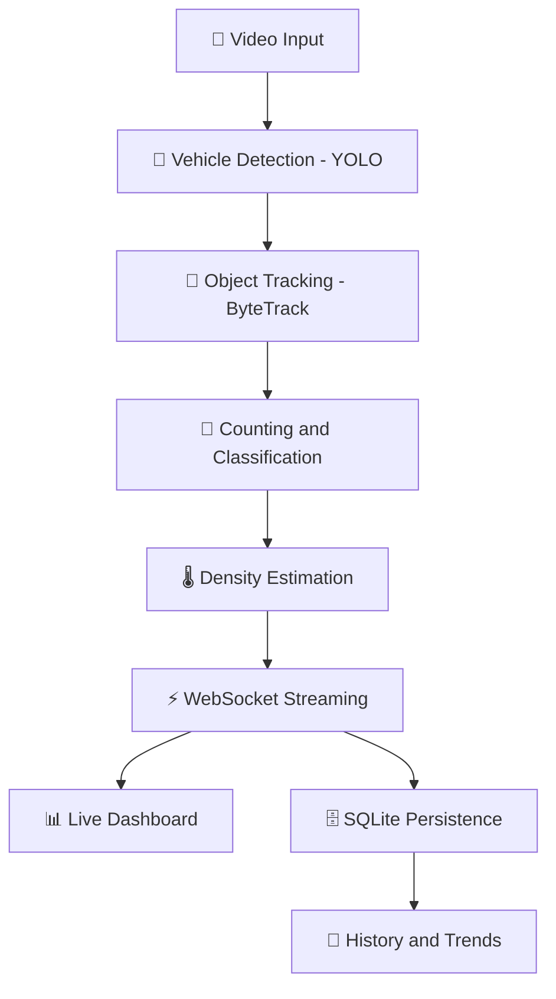

# 🚦 AI Traffic Analyzer


**AI-powered traffic video analysis: detect, track, count, and classify vehicles, estimate real-time traffic density, and visualize it all on a live analytics dashboard.**

Built as a college mini project combining **Computer Vision**, **AI**, **Web Development**, and **Data Visualization**.

---

## 📖 Table of Contents

- [Overview](#-overview)
- [Features](#-features)
- [Tech Stack](#️-tech-stack)
- [System Pipeline](#-system-pipeline)
- [Project Structure](#-project-structure)
- [Getting Started](#-getting-started)
- [Application Pages](#️-application-pages)
- [Project Task Tracker](#-project-task-tracker)
- [Dataset Notes](#-dataset-notes)
- [Known Limitations](#️-known-limitations)
- [License](#-license)

---

## 🧭 Overview

Traditional traffic monitoring relies on manual counting or expensive dedicated hardware (inductive loops, radar), neither of which scales or gives vehicle-type-level insight. **AI Traffic Analyzer** turns any uploaded video into structured traffic data using a pretrained YOLO model, tracks vehicles across frames to avoid double-counting, classifies them by type, estimates congestion, and streams the results to a web dashboard in real time — then persists every session so it can be reviewed later.

## ✨ Features

- 🚗 **Vehicle Detection** — pretrained YOLO model detects car, bus, truck, motorcycle, and bicycle per frame
- 🎯 **Multi-Object Tracking** — ByteTrack assigns each vehicle a persistent ID across frames
- 📏 **Line-Crossing Counting** — accurate one-time counts per vehicle, broken down by class
- 🌡️ **Density Estimation** — live congestion level (Light / Moderate / Heavy), smoothed over a rolling window
- ⚡ **Real-Time Streaming** — live analytics pushed to the browser over WebSocket as the video is processed
- 🗄️ **Persistent History** — every session is saved to a database and browsable afterward, with full trend data
- 📊 **Live Dashboard** — video preview, live stat cards, and charts, all fed from the real pipeline

## 🛠️ Tech Stack

| Layer | Technology |
|---|---|
| 🧠 Computer Vision | Ultralytics YOLO (YOLOv8 / YOLO26) + OpenCV |
| 🎯 Tracking | ByteTrack (via Ultralytics `model.track()`) |
| ⚙️ Backend | Python, FastAPI, WebSockets |
| 🎨 Frontend | React + TypeScript, Vite, Tailwind CSS v4 |
| 🗄️ Database | SQLite via SQLAlchemy |
| 🚀 Deployment (planned) | Docker |

## 🔄 System Pipeline



## 📁 Project Structure

```
AI_Traffic_Analyzer/
├── backend/
│   └── app/
│       ├── main.py                # FastAPI app, routes, WebSocket
│       └── core/
│           ├── pipeline.py         # Detection + tracking + counting + density
│           ├── database.py         # SQLAlchemy engine/session setup
│           └── db_models.py        # Session, FrameSnapshot, VehicleCount models
├── frontend/
│   └── src/
│       ├── App.tsx                 # Root app shell, routing between pages
│       ├── hooks/
│       │   └── useAnalyticsSocket.ts
│       ├── services/
│       │   └── api.ts              # REST calls to the backend
│       └── components/
│           ├── LandingView.tsx
│           ├── LoginView.tsx
│           ├── DashboardView.tsx
│           ├── ReportsView.tsx
│           ├── HistoryView.tsx
│           ├── SettingsView.tsx
│           ├── ProfileView.tsx
│           ├── AboutView.tsx
│           └── UploadModal.tsx
├── database/                       # SQLite file lives here at runtime
├── .gitignore
└── README.md
```

## 🚀 Getting Started

### Prerequisites
- Python 3.10+
- Node.js 18+
- (Optional) NVIDIA GPU + CUDA for faster inference

### Clone the repository
```bash
git clone https://github.com/adityyapratapsingh22/AI_Traffic_Analyzer.git
cd AI_Traffic_Analyzer
```

### Backend setup
```bash
cd backend
python -m venv venv
venv\Scripts\Activate.ps1      # Windows PowerShell
pip install ultralytics opencv-python fastapi "uvicorn[standard]" python-multipart websockets sqlalchemy
uvicorn app.main:app --reload
```

### Frontend setup
```bash
cd frontend
npm install
npm run dev
```

Open **http://localhost:3000** (or 5173, depending on config) with the backend running at **http://localhost:8000**.

## 🖥️ Application Pages

| Page | Purpose |
|---|---|
| 🏠 Landing | Marketing/intro page explaining the project |
| 🔐 Login | Authentication screen |
| 📊 Dashboard | Live analysis — upload a video and watch real-time detection, tracking, and density stats |
| 📄 Reports | Detailed session report view |
| 📜 History | Browse and review past analysis sessions with saved trend data |
| ⚙️ Settings | Configure density thresholds, counting line, and other pipeline parameters |
| 👤 Profile | User account details |
| ℹ️ About | Project explanation, pipeline diagram, and tech stack credits |

---

## ✅ Project Task Tracker

### Phase 1–5: Computer Vision Pipeline
| Task | Status |
|---|---|
| Environment setup (GPU-accelerated YOLO) | ✅ Done |
| Vehicle detection (YOLO, pretrained) | ✅ Done |
| Multi-object tracking (ByteTrack) | ✅ Done |
| ID-switch / class-flicker noise filtering | ✅ Done |
| Line-crossing vehicle counting | ✅ Done |
| Traffic density estimation | ✅ Done |

### Phase 6–7: Backend
| Task | Status |
|---|---|
| FastAPI backend with `/api/upload` | ✅ Done |
| Live WebSocket analytics streaming | ✅ Done |
| SQLite persistence (sessions, snapshots, counts) | ✅ Done |
| Session history REST endpoints | ✅ Done |
| User authentication (real, backend-enforced) | ❌ Not started |
| Settings values connected to backend config | ❌ Not started |

### Phase 8: Frontend
| Task | Status |
|---|---|
| Live Analysis dashboard wired to real data | ✅ Done |
| Video preview panel | ✅ Done |
| Real-time trend + class-breakdown charts | ✅ Done |
| History page wired to real sessions | ✅ Done |
| Landing / About / Profile pages (UI) | ✅ Done |
| Login page (functional auth) | ❌ Not started (UI only) |
| Settings page (functional, saved to backend) | ❌ Not started (UI only) |
| Reports page with real PDF export | ❌ Not started |

### Deployment & Extras
| Task | Status |
|---|---|
| Docker packaging | ❌ Not started |
| Live camera / RTSP feed support | ❌ Not started |
| Vehicle speed estimation | ❌ Not started |
| Multi-camera support | ❌ Not started |

---

## 📊 Dataset Notes

Detection uses YOLO pretrained on COCO out of the box — no training required to get started, since it already covers `car`, `truck`, `bus`, `motorcycle`, and `bicycle`. For improved accuracy on regional traffic (e.g. auto-rickshaws, mixed lane discipline), fine-tuning on **IDD (India Driving Dataset)** or **UA-DETRAC** is recommended.

## ⚠️ Known Limitations

- Vehicle classification can flicker between similar classes (e.g. truck vs. bus) on lightweight models like `yolov8n` — resolved for counting purposes via majority-vote classification per track ID.
- ByteTrack can occasionally lose and re-acquire a vehicle mid-frame ("ID switch"), which the line-crossing counter naturally filters out in most cases.
- Density thresholds are currently hardcoded per deployment and not yet tunable from the Settings UI.

## 📄 License

This project is licensed under the MIT License — see the [LICENSE](LICENSE) file for details.

---

**Author:** Aditya Pratap Singh · [@adityyapratapsingh22](https://github.com/adityyapratapsingh22)
